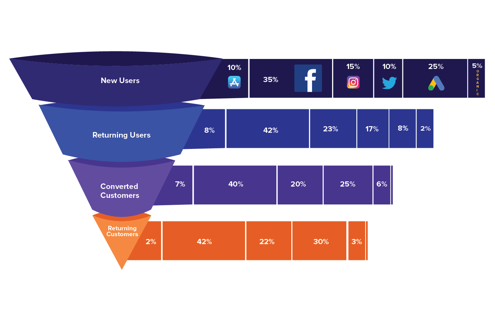

# 2. AARRR
- User Lifecycle/ Use Flow을 기반으로 stage를 구분한 funnel 형태의 흐름을 담은 지표
- 각 단계별 핵시이 되는 지표를 발굴하고 이를 측정/개선하는 지표 관리 방법론
- 단계별 중요한 지표는 서비스/제품 마다 다르니, 우리 서비스를 사용하는 유저의 행동 흐름을 잘 파악하여 지표 설정해야
```
✔ AI competition 플랫폼인 데이콘(Dacon)의 특성을 고려해 각 단계별 지표를 정의하고, 실습해보자
	- New User → Signup → Login or 대회 정보 view →  대회 참여 →  대회 결과물 제출
	- 위와 같이 정의 한 뒤 Fennel 분석을 시도함
	- Dacon에서 제공받은 GA 데이터 일부 정보만 존재해 한계가 있었음
```
[Dacon GA 데이터를 활용한 행동 분석](https://github.com/ssujeong/User_Acquisition-Retention)
---------------------
 
## 2-1. Acqusition
- 사용자를 우리 서비스로 데려오는 것과 관련된 활동
- 고객 유치에 기여(Attribution)한 채널의 성과를 판단할 수 있는 모델을 만드는 것
	- 사용자의 유입 채널을 정확하게 추적하고, 각채널별 성과를 정확히 판단하는게 핵심!
	- organic과 unknown은 다름 → identified와 unknown(Unidentifiable) 관점에서 봐야
	- Web - UTM 파라미터, App - Attibution
- 유저 획득 지표
	- Signup, CAC(Customer Acquisition Cost)
	- CAC + α < LTR(Lifetime Revenue)
		- LTR를 증가시키는 것이 CAC를 감소시키는 것보다 효과적이나, CAC가 상대적으로 Controllable함
- Attribution
	- 각 서비스에 맞는 어트리뷰션 '기준'을 세워서 활용해야 (+ 매채별로도 각 특성을 고려한 기준 적용 필요)
		- Attribution Window (Lookback Window): 인정 기간
		- Click-through / View-through: 인정 행동
		- Attribution Model: 종합 계산/판단 기준
			- First/Last click, Linear, Time Decay, U-Shape
	- Atrribution data + Service data 조합해서 볼 때 많은 insight를 얻을 수 있음

## 2-2. Activation
- Acquisition을 통해 데려온 사용자가, 우리 서비스의 핵심 가치를 경험했는가?
	- 유저들이 서비스를 잘 사용하고, 도중에 이탈/포기하지 않게!
- **Funnel**에 대한 분석이 핵심
	- 유저 경험 단계를 도식화하여, 단계별 전환율(Conversion Rate)을 측정/분석
		- 서비스에 진입하는 순간부터 핵심 가치를 경험하기까지의 경로를 잘 정의해야
	- 각 단계별 전환율 측정 '기준' 설정
		1. 트래픽 기준
			- UI/UX 개선점을 찾는 데 도움을 줌
		2. 사용자 기준
			- UI/UX + 다양한 요소(상품의 매력도, 가격 등)의 영향력이 종합적으로 반영되는 지표
	- Cohort별로 세분화해서, group간 어떤 차이가 있는지 파악 → 전환율에 영향을 미치는 의미있는 선행지표 찾기!
		- Cohort: signup date, channel, campaign, 특정 event 경험 유무, Demo, 외부 변수(시간, 요일, 날씨, ...) 등
		- conversion한 사용자와 하지 않은 사용자는 어떤 것이 다른가? 
- Funnel 개선 방법
	- 개인화(개인화 메시징, 추천 등), UI/UX 변화, 적절한 Use Flow 개입(push, in-app-message)	
	- 각 Stage의 Conversion Rate을 높이는 것보다, Stage를 줄이는 게 효과적인 경우도 많음


	
## 2-3. Retention
- 핵심 가치를 꾸준히 경험하도록 하며, 그 수준을 측정/관리할 수 있는 지표 정의
- 서비스 카테고리별 적정 retention 수준이 다르므로, 목표 수준 잘 정의해야
- 보통 재방문을 기준으로 측정하지만, 꼭 방문이 최선의 기준은 아님 
	- 핵심기능 경험, 다른 행동을 기준으로 모니터링할 수도 있음
	- 유의미한 행동이 반복되는지 살펴보는 것이 중요한 지표임
- Retention 측정 방법 3가지
	1. Classic Retention
		- Day 0에 처음 특정 event를 발생시킨 유저 중 특정  Day N에 해당 event를 발생시킨 유저 비율
			- 그 사이에 몇번, 반복적으로 사용했는지는 고려하지 않음
			- noise를 줄이기 위해 다수의 기준일을 사용해 측정 후, 평균값 활용 
		- Daily Use가 중요한 서비스에서 사용
			- DAU/MAU 비율을 통해, 사용자가 특정 서비스에 얼마나 Engage됐는지 가늠 가능
			- Engagement: 매일 동일한 사용자가 반복적으로 들어오는지 or 새로운 사용자가 들어오는 지를 가늠할 수 있는 지표
	2. Range Retention
		- Range 0에 처음 특정 event를 발생시킨 유저 중 특정 Range N에 해당 event를 1번이라도 발생시킨 유저의 비율
		- Daily Use가 덜 중요한 서비스에서 사용
	3. Rolling Retention
		- Day 0에 처음 특정 event를 발생시킨 유저 중 특정 N day에 해당 event를 발생시킨 기록이 있는 유저
			- 마지막 event 이전까지 유효하며, 이후는 이탈했다고 판단함
			- 과대평가될 위험이 있으며, retention이 계속 변화함
		- 자주 쓰이지 않는 서비스에서 사용 (필요한 때만 찾는 서비스)

- 시간에 다른 변화 추이 확인(유지율, 규모) & Cohort별 차이 확인 (가입일/월, 첫구매일/월, 유입 채널, ...) 
	- 초기 Retention rate 감소 속도 최대한 늦추기 + 이후 오랜 기간 유지 (안정화)
		- 초기에는 Activation 프로세스의 영향을 많이 받음 (New User Experience 영역)
	- 일시적 수치에 매몰되지 말고, 장기적인 Retention 보기!  (외부적인 요인에 많은 영향을 받는 지표)

## 2-4. Revenue
- 어떤 Business Model을 가지고 있고, 그게 잘 동작하는가? 확인 필요
- Revenue 관련 주요 지표
	1. ARPU(Average Revenue Per User) → ARPMAU, ARPDAU, ...
		- 전반적인 수익화 상황을 파악하는 데 유용하며, 이후 사용자가 늘어났을 때 매출이 얼마나 증가할지 가늠 가능
		- 그 외 비슷한 지표로 ARPPU(Average Revenue Per Paying User), ASP(Average Selling Price)가 있음
		- 위 지표 모두 **특정 기간**에 대한 지표로, 보통 **Monthly**로 기간을 구분해서 보며, Daily로도 구분 가능
	2. Lifetime Revenue
		- LTV 계산에는 많은 가정이 필요해 현실에서 적용 불가능 대신 → LTR 활용
		- **한 명의 고객**이 진입부터 이탈까지 전체 활동기간 동안 누적해서 발생시키는 **매출**
			→ 1명의 가입자가 생겼을 때 기대할 수 있는 평균 매출
			- CAC + α < LTR 등에 활용
```
✔Revenue를 Funnel에 따라 세분화해서 보기!
	- 매출 증가/감소 패턴에 대해 세부적인 원인 파악 가능
		- ex. 리텐션, 결제비율, ARPPU 등이 높아져서 (원인) 전월 대비 매출이 증가함
		- 반대로 특정 지표 개선에 따른 다른 지표나 매출에 대한시뮬레이션도 가능
	- Revenue = 결제자수 * ARPPU 
		 = 활동회원 * 결제비율 * ARPPU 
		 = 가입자 * 리텐션(잔존율) * 결제비율 * ARPPU
		 = 설치수 * 가입전환율 * 리텐션 * 결제비율 * ARPPU  
```
- 유저 Grouping의 중요성과 방법
	- 실제 수익화 지표는 개인별 편차가 심함
		- 전체 사용자의 20%가 전체 매출의 80%를 결제하는 패턴이 흔함
		- '평균 사용자'와 같은 모호한 타겟 사용 시, 상위 일부 사용자의 특정 행동으로 인해 수익화 지표가 크게 변동할 수 있음
		- 다양한 방식으로 사용자를 그룹핑하고 각 그룹에 맞는 운영/수익화 전략을 세우는 것이 중요! 
	- **RFM**
		- 서비스 특성 맞게 범위와 점수 기준을 정의한 후 계산
			1. Recency (최근 결제일)
			2. Frequency (결제 횟수)
			3. Monetary (결제 금액 합계)
		- Heavy User, New User, Churn user, Churn Heavy User 등 유저를 세분화해서 파악 가능

## 2-5. Referral
- 기존 사용자의 추천/초대, 입소문을 통한 사용자 확대
	- 무료가 아님 (초대에 따른 현금성 보상 많음)
	- 자연스러운 초대 맥락과, 초대하는/초대받는 사람이 얻는 혜택 중요!
	- 가입과 온보딩 프로세스가 얼마나 최적화 되어있냐에 따라 referr의 효과가 달라짐
- Viral Coefficient
	- 초대를 통해 들어온 사용자의 비율
		- 1보다 클 때 복리효과가 나타나며, 1미만이면 성장이 멈춤
		- User * invitation rate * invitations sent per user * conversion rate / User
	- 초대 주기에 대한 고려가 없으므로, 바이럴 계수와 초대 주기를 같이 봐야함
	- 초대 받을 수 있는 사람이 무한하지 않기 때문에, 전체 target 시장에서 포화도 파악 필요
- Viral이 일어날 수 있도록 좋은 제품/서비스를 만드는 게 우선이며, 그 이후에 고민해야 되는 부분 
	- 필수로 진행해야되는 것이 아니며, referral은 잘 동작하지 않는 일반적

-------

## :white_check_mark:
```
	- Use Flow에 따라 각 단계를 정의하고, 단계별 핵심지표를 설정하자
	- 그리고 그 핵심지표를 'Cohort별로 세분화'해서 '그룹간 차이'와 '기간에 따른 추이'를 파악하는 것이 핵심!
	- 각 단계별 지표를 최적화하는 것에 너무 매몰되면, Local 최적화 될 수도 
		→ 우리의 목표는 'Global 최적화'라는 것을 잊지 말자!
```

