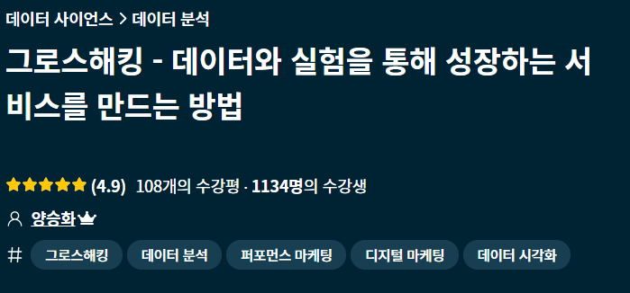
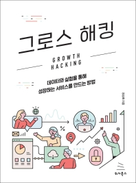

# :seedling: Growth Hacking

## 1. 기초 이해 쌓기
- inflearn 강의와 책을 통해, 그로스해킹에 대한 전반적인 이해와 방법론의 기초를 쌓았다.
```
	- 그로스해킹의 개념 및 활용
	- AARRR 기반의 핵심지표 정의 및 분석방법
	- 데이터 수집과 분석을 위한 환경 구축
	- A/B Test 등 그로스해킹을 위한 다양한 방법론
	- 그로스팀 구성 및 성장을 위한 조직 문화
```
- 추가로, [데이콘 Google Analytics 데이터를 활용하여 주요 개념을 실습함](https://github.com/ssujeong/User_Acquisition-Retention)

### 1-1. inflearn 강의 - 그로스해킹 (데이터와 실험을 통해 성장하는 서비스를 만드는 방법)
- 1차: 5/22 ~ 5/26
- 2차: 6/17 ~ 7/6


### 1-2. 책 - 그로스해킹 (데이터와 실험을 통해 성장하는 서비스를 만드는 방법)
- 1차: 3/9 ~ 3/19
- 2차: 6/17 ~ 7/6



## 2. 실무 역량 높이기
### 2-1. AB180 - (Amplitude) 리텐션 마스터하기 Part 1, 2
- 유저 행동 기반으로 리텐션을 높이는 전략 수립 방법에 대한 이해를 높일 수 있었다.
- Part 1: 7/7
- Part 2: 7/8
 
### 2-2. 그로스해킹/마케팅 실무자의 노하우와 인사이트를 담은 컨퍼런스
- 그로스쿨 강의 (7/19 ~ 7/21)
	- 별거 아닌 그로스 해킹, 퍼널을 파자
	- 프로모션 전략의 A to Z 프레임
	- 데이터 드리븐 마케팅

### 2-3.  GA, A/B 테스트 관련 개념 & 실습 강의 (패스트캠퍼스)
- 8/9 ~ 8/20

## 3. Finally!🔥 직접 설계, 구현, 분석까지 (Toy Project) 🕹

