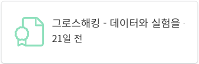

# Growth Hacking 

## 그로스해킹 - 데이터와 실험을 통해 성장하는 서비스를 만드는 방법
- 양승화님의 inflearn 강의와 책으로 그로스해킹에 대한 전반적인 이해와 방법론의 기초를 배울 수 있었다.
	- 그로스해킹의 개념 및 활용
	- AARRR 기반의 핵심지표 정의 및 분석방법
	- 데이터 수집과 분석을 위한 환경 구축
	- A/B Test 등 그로스해킹을 위한 다양한 방법론
	- 그로스팀 구성 및 성장을 위한 조직 문화

### 1. inflearn 강의
 

### 2. 책

- 배웠던 것을 복습하며, 주요 내용을 정리해 올리려고 한다.
- 유료 강의임을 고려해 피해가 가지 않도록, 내용 전부를 정리하기 보다는 주요 개념과 나만의 예시/생각을 정리할 예정!